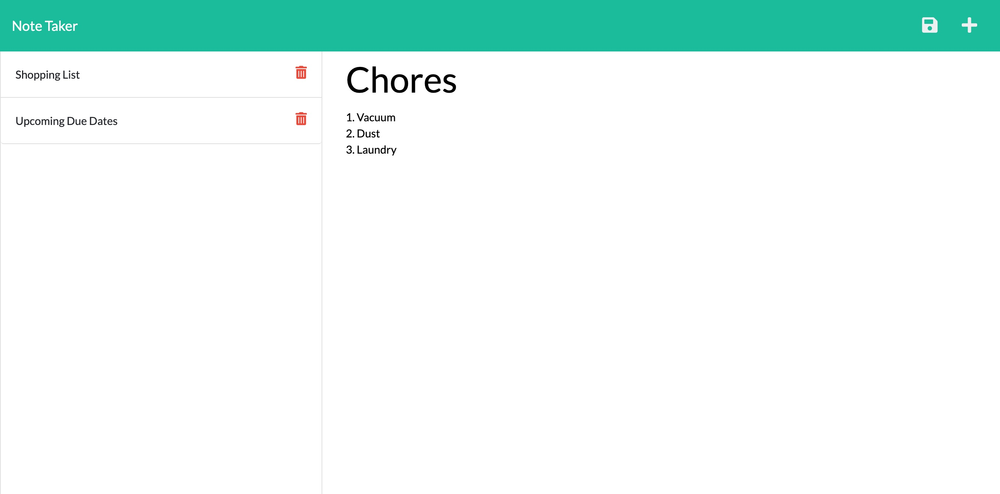

# Homework 11: note-taker

## Table of Contents
* [Description](#description)
* [Installation](#installation)
* [Usage](#usage)
* [License](#license)
* [Contributing](#contributing)
* [Questions](#questions)
  
## Description
The objective of this assignment was to add server and html routes to a starter package of code to link the index and notes html pages as well as saving and retrieving data from the db.json file. I started by creating a route from the server.js file in the root of the file. Next, I created 3 files in the routes folder, an index file to send html and api requests to seperate files. Then I created the code to handle the api requests to create, save, and retrieve notes to the db.json file. Our last objective was to deploy the code to Heroku so that it could help with the server port. 

## Installation
Clone the project to your local computer than run an npm install.

## Usage
To use this project, type "node index.js" in your terminal and then respond to all the prompts.

## License
This project is licensed through MIT.

## Contributing
Please reach out to me if you would like to contribute to my project by email.

## Questions
If you have any questions, please contact me at sjobergkarna@gmail.com or on GitHub with this link [kesjoberg](https://github.com/kesjoberg).

## Screenshot of my deployed paged

## Link to GitHub Repository
https://github.com/kesjoberg/note-taker
 
 ## Link to Deployed Code on Heroku
https://kesjoberg-note-taker.herokuapp.com/